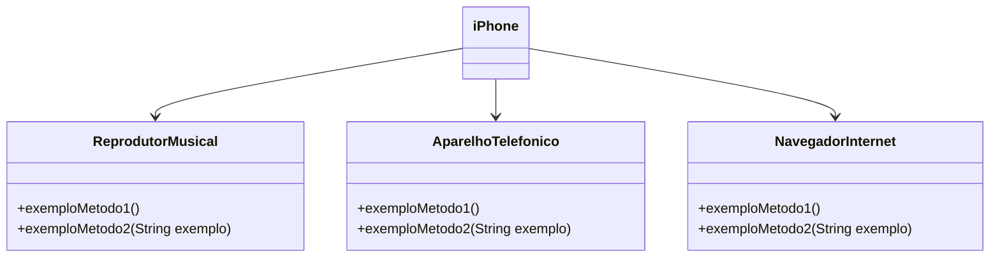

```mermaid
classDiagram
    class ReprodutorMusical {
        +exemploMetodo1()
        +exemploMetodo2(String exemplo)
    }

    class AparelhoTelefonico {
        +exemploMetodo1()
        +exemploMetodo2(String exemplo)
    }

    class NavegadorInternet {
        +exemploMetodo1()
        +exemploMetodo2(String exemplo)
    }

    class iPhone {
    }

    iPhone --> ReprodutorMusical
    iPhone --> AparelhoTelefonico
    iPhone --> NavegadorInternet
```
